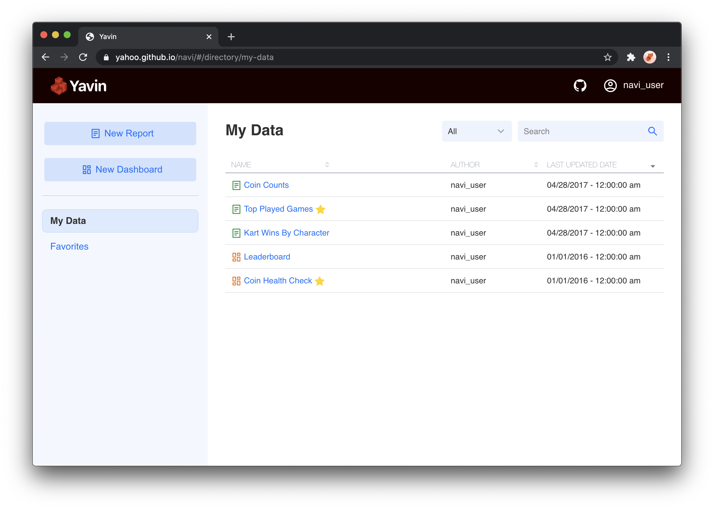

  

<h1 align="center">Yavin</h1>

Rapidly build production quality analytics applications

    <a href="https://yavin.dev">Docs</a> - <a href="https://yahoo.github.io/yavin">Demo</a> - <a href="https://spectrum.chat/yavin">Community</a>

## Yavin Framework [![Pipeline Status][status-image]][status-url]

Yavin is a framework for rapidly building custom data applications that offers both a UI and an API.
Yavin can also be deployed as a standalone business intelligence tool in a few simple steps.
Build reports, assemble dashboards, and explore data with ad-hoc queries.

Jump right in with the [demo app](https://yahoo.github.io/yavin) or run it yourself by following our [quick start guide](https://yavin.dev/pages/guide/02-start.html).

## Packages

You can install the individual packages via npm

| Package                                                                                                                        | Description                                                          |
| ------------------------------------------------------------------------------------------------------------------------------ | -------------------------------------------------------------------- |
| admin                                                                                                                          | 🚧 Under construction panel for managing users/roles/etc 🚧          |
| [][npm-navi-core]                                     | Library of visualizations and common components                      |
| [][npm-navi-dashboards]             | Collection of components for creating collections of visualization   |
| [][npm-navi-data]                                     | Adapters and serializers for connecting to data sources (elide/fili) |
| [][npm-navi-directory]                 | Overview of all saved/favorited reports and dashboards               |
| [][npm-navi-notifications] | Helper library for in app alerts                                     |
| [][npm-navi-reports]                         | Collection of components for building advanced ad-hoc reports        |
| [][npm-navi-search]                             | Global search bar experience                                         |

## Contributing

Assuming you have git, node (>=10), and [ember-cli](https://cli.emberjs.com/release/)

- `git clone https://github.com/yahoo/yavin.git`
- `cd yavin`
- `npm install`
- `cd packages/reports` (or whichever package)
- `ember s` to run a local server
- Then `npm test` to test your changes

See [CONTRIBUTING.md](https://github.com/yahoo/yavin/blob/master/CONTRIBUTING.md)

## Resources

- Documentation on [yavin.dev](https://yavin.dev)
- Chat on [spectrum.chat](https://spectrum.chat/yavin)
- Feature Roadmap [projects](https://github.com/yahoo/yavin/projects)
- For more information on using ember-cli, visit [https://ember-cli.com/](https://ember-cli.com/).
- For more information on using lerna, visit [https://lerna.js.org](https://lerna.js.org)

## License

This project is licensed under the [MIT License](LICENSE.md).

[status-image]: https://cd.screwdriver.cd/pipelines/6102/badge
[status-url]: https://cd.screwdriver.cd/pipelines/6102
[npm-navi-core]: https://www.npmjs.com/package/navi-core
[npm-navi-dashboards]: https://www.npmjs.com/package/navi-dashboards
[npm-navi-data]: https://www.npmjs.com/package/navi-data
[npm-navi-directory]: https://www.npmjs.com/package/navi-directory
[npm-navi-notifications]: https://www.npmjs.com/package/navi-notifications
[npm-navi-reports]: https://www.npmjs.com/package/navi-reports
[npm-navi-search]: https://www.npmjs.com/package/navi-search
