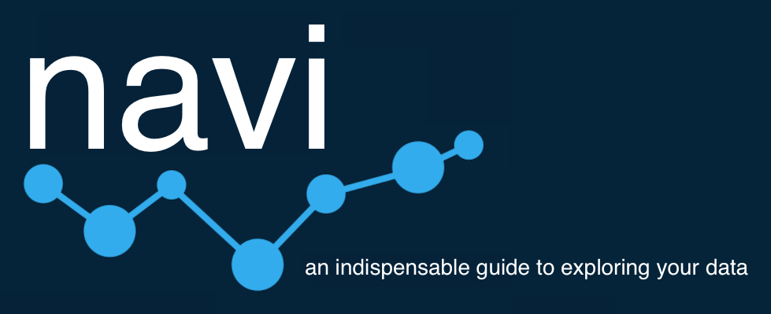

Navi is a production quality analytics reporting UI with _out of the box_ support for [Fili](http://fili.io/).

## Try it

Start exploring our sample data with the [demo app](https://yahoo.github.io/navi).

## Requirements

- node >= 4

## Table of Contents

- [Installation](https://github.com/yahoo/navi#Installation)
- [SubPackages](https://github.com/yahoo/navi#SubPacakages)
- [Contribution](https://github.com/yahoo/navi#Contribution)
- [License](https://github.com/yahoo/navi#License)

## Installation

You can install the individual packages via npm

- [navi-reports](https://www.npmjs.com/package/navi-reports)
- [navi-core](https://www.npmjs.com/package/navi-core)
- [navi-dashboards](https://www.npmjs.com/package/navi-dashboards)
- [navi-directory](https://www.npmjs.com/package/navi-directory)
- [navi-data](https://www.npmjs.com/package/navi-data)
- [navi-app](https://www.npmjs.com/package/navi-app) 

Please see the detailed installation instructions in the README of the individual packages for more info.

## Sub Packages

---

- [navi-reports](https://github.com/yahoo/navi/tree/master/packages/reports)
- [navi-core](https://github.com/yahoo/navi/tree/master/packages/core)
- [navi-dashboards](https://github.com/yahoo/navi/tree/master/packages/dashboards)
- [navi-directory](https://github.com/yahoo/navi/tree/master/packages/directory)
- [navi-data](https://github.com/yahoo/navi/tree/master/packages/data)
- [navi-app](https://github.com/yahoo/navi/tree/master/packages/app)
- [navi-webservice](https://github.com/yahoo/navi/tree/master/packages/webservice)

## Contribution

See [CONTRIBUTING.md](https://github.com/yahoo/navi/blob/master/CONTRIBUTING.md)

### Setup

- Clone this repo
- `npm install`

### Running

#### Navi Application

- `npm start`

#### Sub Packages

- `cd` to the sub-package you want to run
- `ember serve`
- Visit your app at [http://localhost:4200](http://localhost:4200).

### Running Tests

- `npm test`

For more information on using ember-cli, visit [https://ember-cli.com/](https://ember-cli.com/).
For more information on using lerna, visit [https://lerna.js.org](https://lerna.js.org)

## License

This project is licensed under the [MIT License](LICENSE.md).
