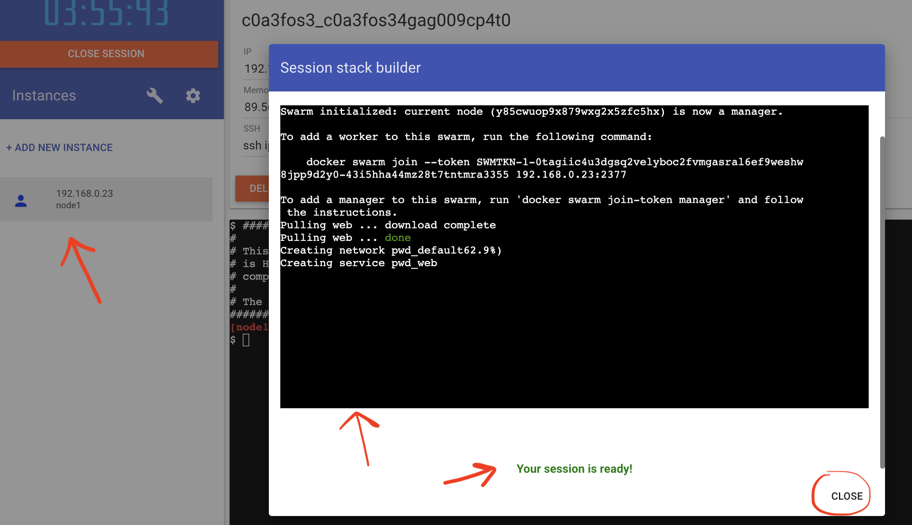
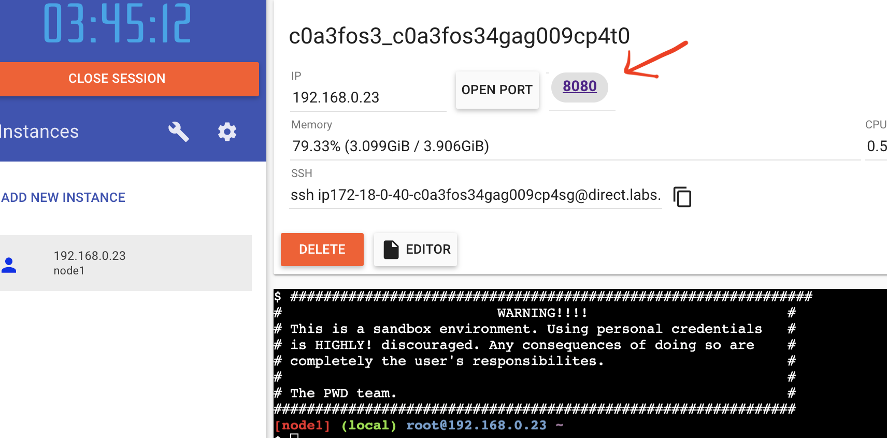

# Run Yavin in Docker containers

Yavin can be easily deployed using docker containers. We maintain multiple dockerfiles for different types of images. However there will be one common base image.

## Docker registry

We use docker hub to keep our images updated and available. Docker hub is integrated back to github. It will detect changes to the master branch and build (and tag) images automatically. The permission to docker hub is limited to few users only.

https://hub.docker.com/repository/docker/verizonmedia/yavin/general
[Yavin DockerHub](https://hub.docker.com/repository/docker/verizonmedia/yavin/general)

```
org: verizonmedia
repo: yavin_base, yavin_demo, yavin
```

## Docker file for base image

We create a base image using Alpine Linux. This base image will have all the requried dependencies available. It will not have any entrypoint.

```
Dockerfile.alpine
```

## Yavin Base image

For any other environments like heroku (or cloud) use base image `verizonmedia/yavin_base:latest`
In your custom Dockerfile you can start as:

```
FROM verizonmedia/yavin_base:latest
```

## Docker file for local demo

docker build -f container/docker/Docker.alpine

```
Dockerfile.demo_local
```

## Yavin Local demo image

For any other environments like heroku (or cloud) use base image `verizonmedia/yavin_demo:latest`
To run yavin demo using docker container:

```
docker run -p 9999:8080 verizonmedia/yavin_demo:latest
```

## Launch in Dokcer using PWD

[](https://labs.play-with-docker.com/?stack=https://raw.githubusercontent.com/anupkumangodan/navi/pwd_1/container/docker/docker-compose.yml)

You will be taken to "play with docker" UI where you might have to sign-in (or register first) to continue.
After the initial docker compose and swarm is setup, proceed to click on the port (8080) hyperlink in PWD.

PWD is not production grade platform, so it can show unexpected results. When the above button is clicked and after you sign-in, docker swarm build will start up in a small pop up window. The process will complete in few mins as shown.



If the above step completed successfully, click the close button on the popup window.Then you can click (hyperlink) 8080 at the top as shown below.



## Heroku launch

Coming soon...
